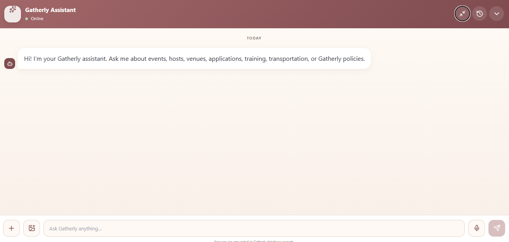
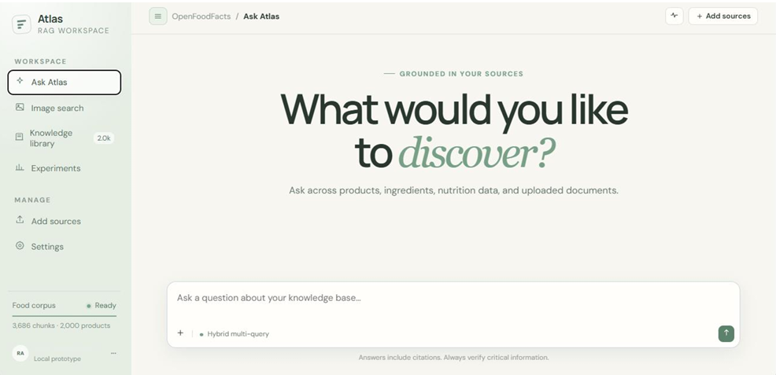
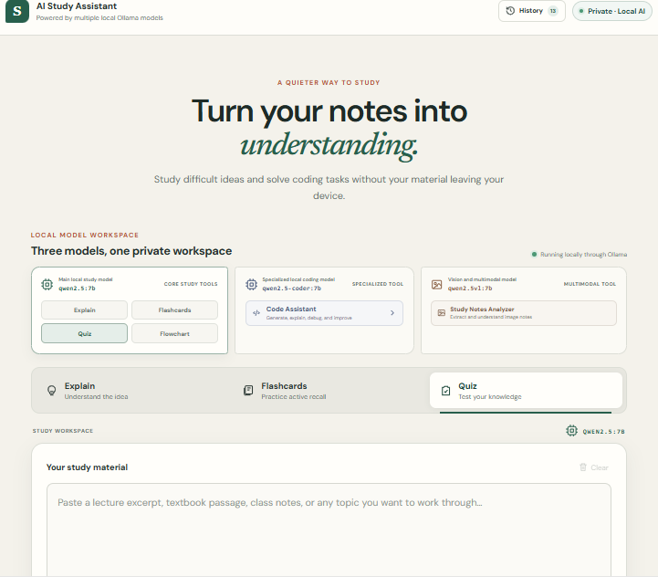
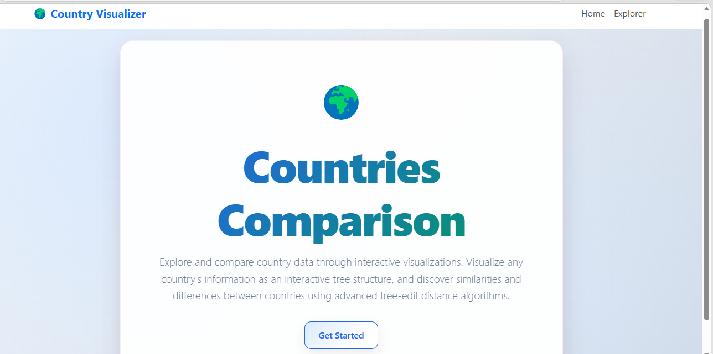
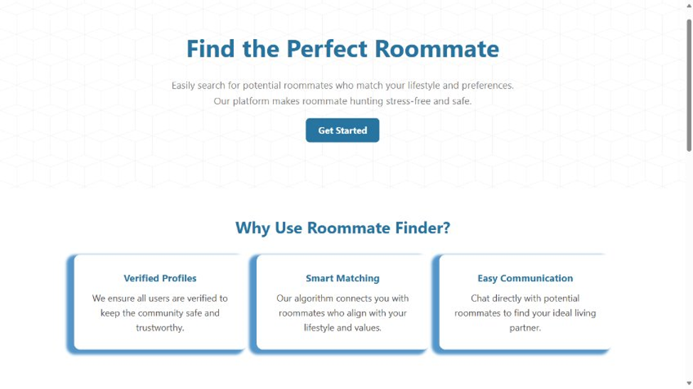

  

---

## Technical Skills

**ML & AI** &nbsp;

`PyTorch` &bull; `TensorFlow` &bull; `scikit-learn` &bull; `LangGraph` &bull; `Google ADK` &bull; `Qdrant`

Deep Learning &bull; NLP &bull; Computer Vision &bull; LLMs &bull; RAG &bull; Unsupervised Learning

**Programming** &nbsp;

`Python` &bull; `C++` &bull; `Java` &bull; `JavaScript` &bull; `SQL` &bull; `Assembly`

**Software** &nbsp;

`FastAPI` &bull; `React` &bull; `Node.js` &bull; `Express.js` &bull; `MySQL` &bull; `REST APIs`

**Tools & Systems** &nbsp;

`Git` &bull; `Docker` &bull; `Linux` &bull; `NVIDIA Isaac Sim`

---

## Featured ML & AI Projects

### [Gatherly — Multi-Agent Event Platform](https://github.com/diakhalil/Gatherly_Chatbot)

- Built a **LangGraph multi-agent assistant** with supervisor routing across specialized **RAG, SQL, host, and admin agents**.
- Developed a **multilingual and multimodal RAG pipeline** using **Qdrant**, hybrid retrieval, metadata filtering, and reranking.
- Fine-tuned **DistilBERT** for event-issue classification and integrated **Whisper** for voice interaction.
- Integrated **MCP tools** for weather, routing, and visualization capabilities.
- Built a separate **Google ADK agent** to generate invitation websites and deploy them through **Netlify**.

**Tech:**

`LangGraph` &bull; `DistilBERT` &bull; `Whisper` &bull; `RAG` &bull; `Qdrant` &bull; `MCP` &bull; `Google ADK` &bull; `Netlify`

> **Retrieval Results:** 94.9% Recall@5 • 100% document recall

 

### [Multimodal Consumer Product Search](https://github.com/diakhalil/ProductSearchRAG)

- Built a **multilingual and multimodal RAG system** for retrieving and comparing product prices, ingredients, allergens, and availability.
- Implemented **embedding-based vector retrieval**, metadata filtering, and reranking to improve product search relevance.
- Supported **natural-language search** across languages with semantic retrieval over product information.
- Added **barcode-based retrieval** for direct product lookup and **image-based search** for visually similar/relevant products.
- Integrated retrieved product data into grounded responses for **product comparison and information queries**.

**Tech:**

`Multimodal RAG` &bull; `Vector Search` &bull; `Embeddings` &bull; `Reranking` &bull; `Multilingual` &bull; `Image Search`

> **Search Interfaces:** Natural-language queries • Barcode scanning • Image search

 

### [User Behavior Prediction](https://github.com/diakhalil/User_Behavior_Prediction)

- Built a **supervised classification system** to predict whether users complete food-delivery orders based on their interaction behavior.
- Addressed a **highly imbalanced dataset**, applying imbalance-handling strategies and comparing models including **Logistic Regression, Random Forest, and XGBoost**.
- Evaluated models primarily using **ROC-AUC** rather than accuracy to better assess predictive performance under class imbalance.

**Tech:**

`Python` &bull; `scikit-learn` &bull; `XGBoost` &bull; `Classification`

> **Evaluation:** ROC-AUC

 

### [Multimodal LLM Learning Assistant](https://github.com/diakhalil/LLM_Learning_Assistant)

- Built a **multimodal AI learning assistant** supporting explanations, quizzes, flashcards, code generation/debugging, image-based note analysis, and flowchart generation.
- Implemented **task-aware model routing** to direct requests to specialized **general-purpose, coding, or vision-language models**.
- Integrated a **vision-language model (VLM)** for analyzing visual inputs and a specialized coding model for programming-related tasks.
- Generated **Mermaid flowcharts** from learning content to provide visual explanations of concepts and processes.

**Tech:**

`LLMs` &bull; `Vision-Language Model` &bull; `Task Routing` &bull; `FastAPI` &bull; `React` &bull; `Mermaid`

> **Key Capability:** Task-aware routing across general-purpose, coding, and vision-language models

 

### [IMDb Sentiment Classification](https://github.com/diakhalil/IMDb_Sentiment_Classification)

- Built an **NLP sentiment classification pipeline** for binary classification of IMDb movie reviews.
- Compared **RNN, LSTM, and BiLSTM architectures** across multiple text representations, including **Word2Vec, GloVe, and TF-IDF**.
- Evaluated different model–embedding combinations to analyze the impact of **sequence architecture and word representations** on classification performance.
- Achieved approximately **90% test accuracy** with the best-performing configuration.

**Tech:**

`PyTorch` &bull; `NLP` &bull; `RNN` &bull; `LSTM` &bull; `BiLSTM` &bull; `Word2Vec` &bull; `GloVe` &bull; `TF-IDF`

> **Best Result:** ~90% test accuracy

 

### [Wikipedia Infobox Comparison System](https://github.com/diakhalil/Infobox_Comparison_System)

- Built an **unsupervised ML system** to group and compare countries based on selectable attributes such as **population and geographic area**.
- Applied **K-Medoid and Hierarchical Clustering** to identify groups of countries with similar characteristics.
- Constructed a **Tree Edit Distance (TED) matrix** to quantify structural differences between country infobox representations by measuring the transformations required to convert one tree structure into another.
- Combined **feature-based clustering and structural comparison** to analyze country similarities from different perspectives.

**Tech:**

`Unsupervised Learning` &bull; `K-Means` &bull; `Hierarchical Clustering` &bull; `Tree Edit Distance`

> **Key Focus:** Unsupervised country grouping • Structural similarity analysis

 

---

## Software Projects

### [Gatherly &mdash; Full-Stack Event Management Platform](https://github.com/diakhalil/Gatherly_Event_Management)

Full-stack event-management platform with client, host, and admin roles supporting booking, management, and coordination workflows. 
`JavaScript` &bull; `React` &bull; `Express.js` &bull; `MySQL` &nbsp; 

### [Roommate Finder](https://github.com/diakhalil/Roommate-Finder)

Web platform connecting potential roommates through profiles, filtering, and matching features. 
`EJS` &bull; `JavaScript` &bull; `Express.js` &bull; `PostgreSQL` &nbsp; 

### [Clinic Management System](https://github.com/diakhalil/Clinic_Managment_System)

System for managing patients, appointments, and doctor schedules. 
`C++` &nbsp; 

### [Hotel Booking System](https://github.com/michelle-baalbaky/SmartHotelSystem)

Application for room reservations, availability, and guest information. 
`C++` &nbsp;

---

## Contact

